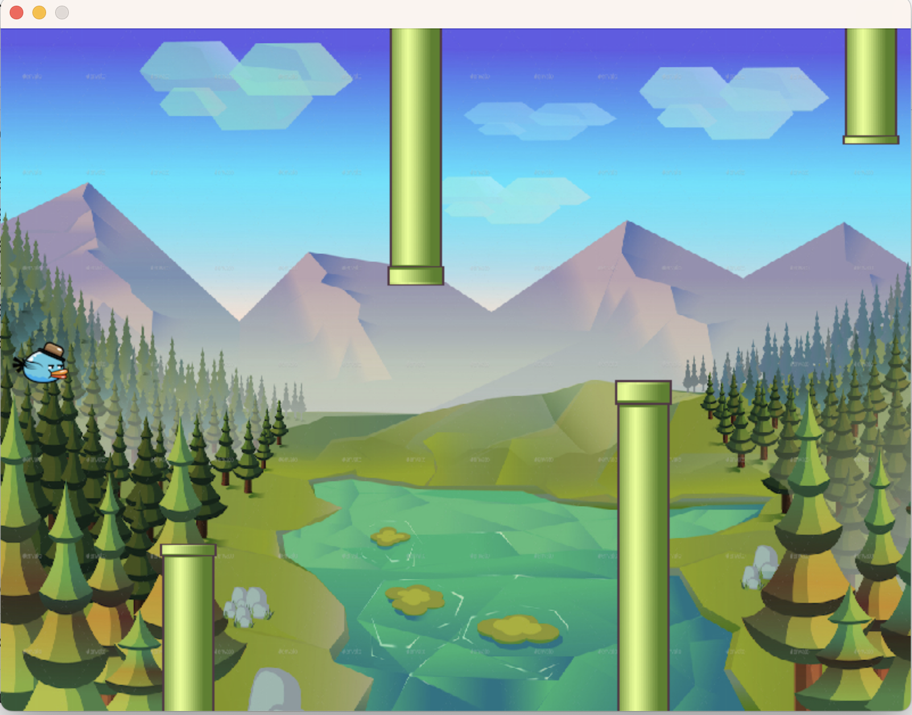

# Flappy gopher

A game created with the Go language + SDL library

Game made by following [JustForFunc](https://www.youtube.com/@JustForFunc) tutorial to get an overview of the language capabilities

## Requirements
#### OSX:
```
brew install sdl2
brew install sdl2_image
brew install sdl2_ttf
brew install sdl2_mixer
```

## How to run it
1. Install dependencies with ``` make dependencies ```
2. Build the application with ``` make build ```
3. Run it! ``` ./dist/main ```

## Gameplay screenshot
